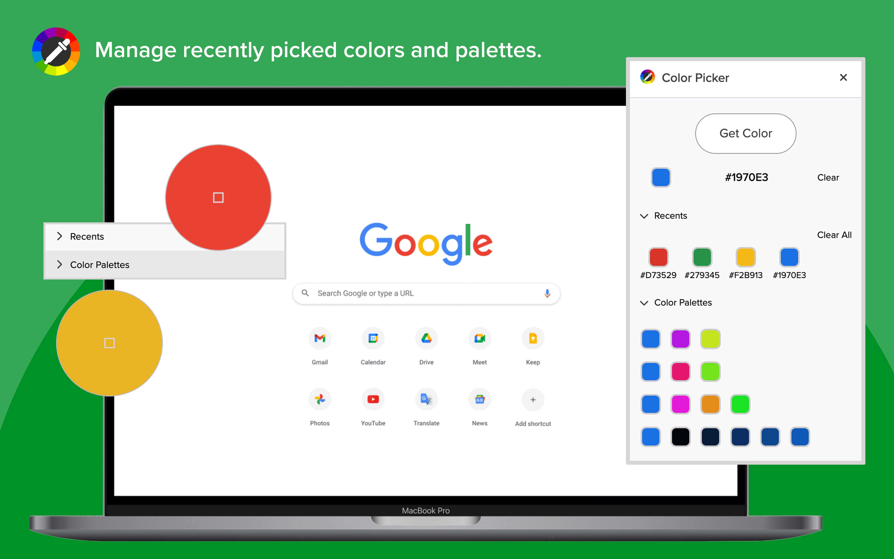

# Color Picker and Palette Generator

## About
Color Finder is a Chrome extension that helps users easily pick colors from any webpage and generate color palettes. It provides an intuitive interface for selecting colors, viewing recent selections, and generating color palettes. 

## Tech Stack
- **HTML**: Markup language used for structuring the extension's interface.
- **CSS**: Styling language used for designing the visual aspects of the extension.
- **JavaScript**: Programming language used for implementing the extension's functionality.
- **TinyColor**: JavaScript library used for color manipulation.
- **ColorThief**: JavaScript library used for extracting color palettes from images.

## Roadmap
### 1.0 Release
- [x] EyeDropper
- [x] Recently picked colors
- [x] Generate color palettes from the most recent color
- [x] Manage colors and palettes
- [x] Copy-to-clipboard for picked colors and palettes
- [x] Clear all picked colors

## Author
Alice Min [alice_min@brown.edu]

